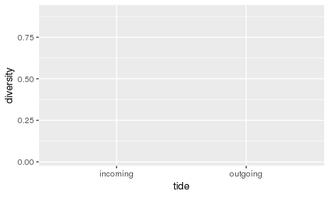
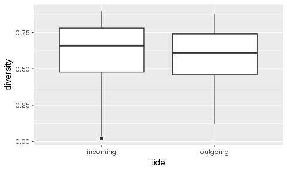
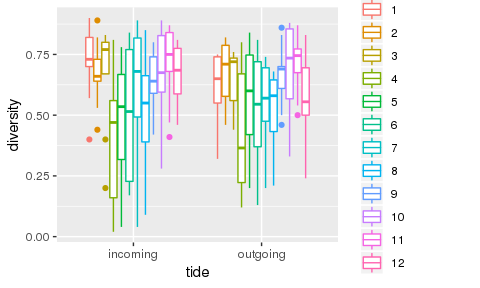
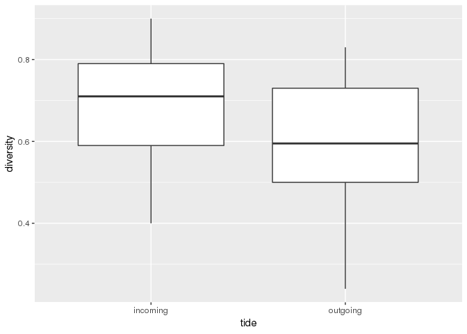

1. Getting Started
==================

**R** is a versatile, free data handling software widely-used by
scientists. **R** is great for organizing data, analyzing data, and
presenting data.

**Log in to the R Studio server at <https://celsrs.uri.edu/>. ** Use
FirstnameLastname as your user id and your URI ID number as your
password.

Here is some basic vocabulary you will need when using **R**.

-   **R script:** the lines of code that you are writing (filename.R)
-   **R project:** your **R** script, any variables you have created,
    and your current R environment (filename.Rproj)
-   **Variable:** a way to store your data for use in the **R** script.
    For example, if you type x=3 into **R**, then **R** now stores x
    (the variable) as the number 3.
-   **Package:** a set of functions/codes that you can load into your
    script (examples - gsheet, ggplot2)
-   **Function:** an action or calculation that you perform on your
    variables (examples - gsheet2tbl, subset, mean, library)
-   **Comment:** does not run as code, starts with \#. You use comments
    to keep track of what your code is doing

More information on **R** is at
<http://www.datacarpentry.org/R-ecology-lesson/00-before-we-start.html#why_learn_r>.

### Helpful Hints

-   Uppercase/lowercase matters!
-   Spaces and empty lines do not matter in your code
-   Do not use spaces in your variable names or file names (use \_ or -
    or . )
-   Links to GoogleSheets need to be in 'single quotes'
-   `#`Comment your code so you know what's going on
-   Store variables using `<-`
-   Access the datapoints in a `variable` using `variable[]`

**Open RStudio and make a new project.**

Select from top left corner:

-   `File` &gt; `New Project...`
-   `New Directory` and `Empty Project`
-   `Directory name:  FieldSampling`
-   Leave the Subdirectory as the default: ~

Select from top left corner:

-   `File` &gt; `New File` &gt; `R Script`

Creating a new project and script will give you four windows in **R**:

-   **R script:** where you type your comments and code, and save your
    work
-   **R environment:** where all your variables show up and are
    organized
-   **R console:** where the code runs and the text output shows. Errors
    show here too!
-   **Graphical output:** where your graphs will show.

### 1a. Load the packages you need

The tools you need are found in "packages". Packages are like books from
the library: pre-written bundles of code that can perform the tasks we
want. They contain functions and commands to perform analyses. Here, we
will load the `gsheet` package.

Type the code (from the grey boxes) into the SCRIPT window of RStudio
(top left). With your cursor on the line of code, click Run (top right
of the SCRIPT window in RStudio). The line of code will show up in the R
console window once it is run (bottom left).

    library(gsheet)
    library(tidyverse)

    ## ── Attaching packages ────────────────────────────────────────── tidyverse 1.2.1 ──

    ## ✔ ggplot2 3.0.0     ✔ purrr   0.2.5
    ## ✔ tibble  1.4.2     ✔ dplyr   0.7.6
    ## ✔ tidyr   0.8.1     ✔ stringr 1.3.1
    ## ✔ readr   1.1.1     ✔ forcats 0.3.0

    ## ── Conflicts ───────────────────────────────────────────── tidyverse_conflicts() ──
    ## ✖ dplyr::filter() masks stats::filter()
    ## ✖ dplyr::lag()    masks stats::lag()

2. How to get your data into R
==============================

Before we get our data into R, let's take a look at the data in the
Sheet. [Click
here](https://docs.google.com/spreadsheets/d/1U-78sk0bx0J7PD30NTe5wq8ZYtgceT1jtxB7yyhQHPY/)
to see the data. In particular,

-   What shape is the data?
-   Are there any categories?
-   What types of data are stored?
-   Anything we could do to make this easier to look at?

### 2a. Tell R where your data is

Assign the link to the data to the variable "`url`". The variable name
goes on the left of the arrow and the information goes on the right.

    url <- 'https://docs.google.com/spreadsheets/d/1U-78sk0bx0J7PD30NTe5wq8ZYtgceT1jtxB7yyhQHPY/'

Remember to click Run with your cursor on the line of code. Once you
have Run this command, make sure your new variable shows up in the R
environment window (top right).

### 2b. Load the data and store it as a variable

Load the data from the spreadsheet (now stored as variable `url`). Use
the function `gsheet2tbl` to get the data from the website for use in
**R**. This function is from the `gsheets` package. Store the data as
variable `diversitydata`.

    diversitydata <- gsheet2tbl(url)

-   The line was run correctly if you get the prompt (`>`) in the R
    console window (bottom left)
-   Make sure the `diversitydata` variable shows up in the R environment
    (top right)

### 2c. Explore your data

Click on the `diversitydata` variable in the R environment. The data
stored in `diversitydata` will appear in the R script window (top left).
It should look just like your spreadsheet data!

3. Plot your data
=================

Let's see how diversity differs between incoming and outgoing tides.

### 3a. Create the base layer of your plot

Use the command `ggplot`:

-   `diversitydata` is the name of the variable containing your data
-   `aes` tells `ggplot` what the plot will look like ("aesthetics")
    including the x and y variables

The graph will show up in the Graphical Output window (bottom right).

    ggplot(diversitydata, aes(x=tide,y=diversity))

### 3b. Add data points to your plot

Add a `geom_boxplot()` layer to your ggplot command to add a boxplot of
your data to your plot.

    ggplot(diversitydata, aes(x=tide,y=diversity)) + geom_boxplot()

    ## Warning: Removed 2 rows containing non-finite values (stat_boxplot).

### 3c. Plot months separately

Maybe diversity differs during the year so we shouldn't plot all data
together.

Add color - note factor

    ggplot(diversitydata, aes(x=tide,y=diversity, color=as.factor(month))) + geom_boxplot()

    ## Warning: Removed 2 rows containing non-finite values (stat_boxplot).

4. Filter data
==============

Since color varies by month let's filter for December and January data

    winter_diversity <- filter(diversitydata, month == 1 | month==12)
    ggplot(winter_diversity, aes(x=tide,y=diversity)) + geom_boxplot()

Compare incoming and outgoing

    t.test(filter(winter_diversity,tide=="incoming")$diversity,
           filter(winter_diversity,tide=="outgoing")$diversity)

    ## 
    ##  Welch Two Sample t-test
    ## 
    ## data:  filter(winter_diversity, tide == "incoming")$diversity and filter(winter_diversity, tide == "outgoing")$diversity
    ## t = 2.0508, df = 32.408, p-value = 0.04844
    ## alternative hypothesis: true difference in means is not equal to 0
    ## 95 percent confidence interval:
    ##  0.0007647783 0.2098888165
    ## sample estimates:
    ## mean of x mean of y 
    ## 0.6958824 0.5905556

5. Spread and Gather
====================

For this exercise we pre-summarized the data. However a typical raw
dataset might look like

    alldata <- read.csv("../shared/NarrBay_countdata_7.31.2018.csv") #note have to download
    alldata <- alldata[-1,] #drop extra row of units

Let's spend some time looking at this dataset together and find all the
challenges!

Importantly, you'll note that for every sample there are counts for each
plankton species. This is really intuitive for a person, but if you were
to graph counts you now have multiple columns containing your y values.
You can use the `gather` function to "tidy" your data and convert it
from wide to long form.

    alldata_long <- gather(alldata, "species", "count", 5:length(colnames(alldata)))

    ## Warning: attributes are not identical across measure variables;
    ## they will be dropped

Don't plot this because it's too much data.

### Now spread

Spread is the inverse operation to gather as it takes long format data
and converts it to wide. Let's try it.

    alldata_wide <- spread(alldata_long, species, count)

Let's now see how the first few columns are different than in our long
format data set.

    # This code returns the first 6 rows (from head()) and the first 5 columns
    head(alldata_long)

    ##        DATE     COUNT.TYPE      LOCATION Total.abundance         species
    ## 1 25-Jan-99 S/R Cell mixed N. Bay sta. 2          124000 Achnanthes.spp.
    ## 2  1-Feb-99 S/R Cell mixed N. Bay sta. 2          113000 Achnanthes.spp.
    ## 3  8-Feb-99 S/R Cell mixed N. Bay sta. 2          107000 Achnanthes.spp.
    ## 4 15-Feb-99 S/R Cell mixed N. Bay sta. 2           95500 Achnanthes.spp.
    ## 5 22-Feb-99 S/R Cell mixed N. Bay sta. 2          163500 Achnanthes.spp.
    ## 6  1-Mar-99 S/R Cell mixed N. Bay sta. 2          113000 Achnanthes.spp.
    ##   count
    ## 1     0
    ## 2     0
    ## 3     0
    ## 4     0
    ## 5     0
    ## 6     0

    head(alldata_wide[,1:7])

    ##            DATE     COUNT.TYPE      LOCATION Total.abundance
    ## 1 *data missing                                             
    ## 2      09/22/13    S/R Surface  N Bay sta. 2         1078200
    ## 3      1-Apr-02 S/R Cell mixed N. Bay sta. 2          110000
    ## 4      1-Apr-11      S/R Depth  N Bay sta. 2         1368000
    ## 5      1-Apr-11    S/R Surface  N Bay sta. 2         1253000
    ## 6      1-Aug-05 S/R Cell mixed N. Bay sta. 2         2693000
    ##   Achnanthes.spp. Actinocyclus.sp. Actinomonas.sp.
    ## 1                                                 
    ## 2               0                0               0
    ## 3               0                0               0
    ## 4               0                0               0
    ## 5               0                0               0
    ## 6               0                0               0

6. Data in Google Sheets
========================

We've been working with data that is easy to load into R. Let's take a
look at the way the data is structured for easy use. Additionally, take
a look at a couple of really nice posts about this storing and using
spreadsheets to store and edit data.

-   [Best Practices for Using Google Sheets in Your Data
    Project](https://matthewlincoln.net/2018/03/26/best-practices-for-using-google-sheets-in-your-data-project.html)
-   [Original Tidy Data
    Paper](http://vita.had.co.nz/papers/tidy-data.html)
-   [Data Organization in
    Spreadsheets](https://peerj.com/preprints/3183/)

### One table per sheet / csv

A common strategy is creating multiple data tables within one
spreadsheet. This confuses the computer, so don’t do this! When you
create multiple tables within one spreadsheet, you’re drawing false
associations between things for the computer, which sees each row as an
observation. You’re also potentially using the same field name in
multiple places, which will make it harder to clean your data up into a
usable form. The example below depicts the problem:

[example
spreadsheet](https://docs.google.com/spreadsheets/d/1KiuE_X0cxITLSi56qMCcPHsQt-hbPTsaE6dpT9sR_ao/edit?usp=sharing)

### Put all your variables in columns - the thing you’re measuring, like ‘weight’ or ‘temperature’.

### Put each observation in its own row.

But, note that sometimes you might want to collect raw data in a
human-intuitive way and gather it in R for the computer to read.

### Don’t combine multiple pieces of information in one cell. Sometimes it just seems like one thing, but think if that’s the only way you’ll want to be able to use or sort that data.

### Leave the raw data raw - don’t change it!

R makes this really easy. You load the raw data and change it within R.
It's easy to come back and repeat those changes (e.g filtering).

### Communicate 0 and null

It might be that when you’re measuring something, it’s usually a zero,
say the number of times a rabbit is observed in the survey. Why bother
writing in the number zero in that column, when it’s mostly zeros?

However, there’s a difference between a zero and a blank cell in a
spreadsheet. To the computer, a zero is actually data. You measured or
counted it. A blank cell means that it wasn’t measured and the computer
will interpret it as an unknown value (otherwise known as a null value).

The spreadsheets or statistical programs will likely mis-interpret blank
cells that you intend to be zeros. By not entering the value of your
observation, you are telling your computer to represent that data as
unknown or missing (null). This can cause problems with subsequent
calculations or analyses. For example, the average of a set of numbers
which includes a single null value is always null (because the computer
can’t guess the value of the missing observations). Because of this,
it’s very important to record zeros as zeros and truly missing data as
nulls. NA (for R) is a good choice for a null value.

### data validation and data protection

It’s easy for a user to accidentally change data they shouldn’t, or to
enter data that doesn’t adhere to the desired schema. In Google Sheets
use the Data &gt; Protected Sheets and Ranges... tool, to restrict
columns that came from the source data, and which need to stay
untouched.

Data &gt; Data validation... offers tools for checking the contents of
what editors had entered: from simply requiring that a value be entered
into a field, to specifying a dropdown menu of possible values, to
running an arbitrary function. For example, you can check whether an
entered number is 9 digits.

### Don’t use formatting to carry data, but DO use formatting to help your editors

You should not use formatting like color or font faces to store
information in a spreadsheet, because it doesn’t survive the conversion
into a CSV or a data frame. If you are using formatting to convey
information (e.g. the need to exclude a particular sample) create a new
field to encode which data should be excluded. However, color and other
formatting cues are vital tools for facilitating user comprehension. Use
formatting to better communicate and highlight data content, but not use
it as a replacement for data content. In Sheets use the Data &gt;
Conditional Formatting... tool to add color cues.

### Metadata

Recording data about your data (“metadata”) is essential. Metadata
should be stored as a separate file in the same directory as your data
file, preferably in plain text format with a name that clearly
associates it with your data file. A folder-level readme.txt file is the
classic way of accounting for all the files and folders in a project.

Credit
======

This tutorial is adapted from the BIO 104 Field Sampling Tutorial and
the [Data Carpentry Spreadsheet Ecology
lesson](https://datacarpentry.org/spreadsheet-ecology-lesson/). More
detail is contained in each of these lessons.
